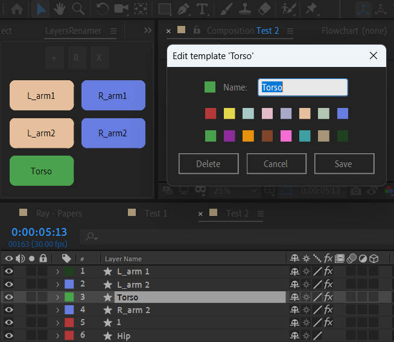

# Layers Renamer plugin for Adobe AE

## Goal

This plugin allows you to quickly apply predefined templates (name & label) to selected layer(s) with just one click of a button!

Templates are stored in a separate `.json` file and are thus shared between projects.

This helps to reduce the amount of repetitive manual labor in consecutive tasks.

## How to use

1. Run script file / open dockable panel
2. Select a file to store templates
3. Press `+`, then specify the name & label color of a new template, and press `Add`
4. Apply template to selected layer(s) by _left-clicking_ the template button
5. Edit/delete existing templates by _right-clicking_ the template buttons
6. Change columns of existing templates by _middle-clicking_ the template buttons
7. Press `R` to reload changes from file
8. Press `X` to forget path to the file (note that this doesn't delete the actual file)

## Installation

Download `LayersRenamer.jsx`

You can now run it in AE as a standalone script via `File -> Scripts -> Run Sript file...`

Or, to install it as a dockable panel, do the following:

1. Launch AE, navigate to `File -> Scripts -> Install ScriptUI Panel...`

    then select the downloaded file

    **or:**

    Manually copy file to the folder `%appData%\Roaming\Adobe\After Effects\<AE version>\Scripts\ScriptUI Panels`

2. Restart AE

## Details

-   The path to a `.json` file is stored in AE Preferences (`Settings_LayersRenamer.dataFilePath`), and thus the same file will be used by all projects in the current AE instance. Since Preferences are not shared by different versions of AE, you will be prompted to select the file again. Then, each version will use its own file (or the same one, if you were to select so).
-   The `.json` file is only being read by a script upon startup and is saved after any change. Thus, you can use the same file in any amount of concurrently running scripts, just be careful not to overwrite a newer version with an older one.
-   The `Allow Scripts to Write Files and Access Network` permission is required to save `.json` files. The script will assist you in granting such permission by opening the Preferences window.
-   The script was written with older AE versions compatibility in mind, and was tested to work with the following:
    -   AE 2020
        -   version 17.0.4 (Build 59)
        -   version 17.1.0 (Build 72)
    -   AE 2024
        -   version 24.0.0 (Build 55)
